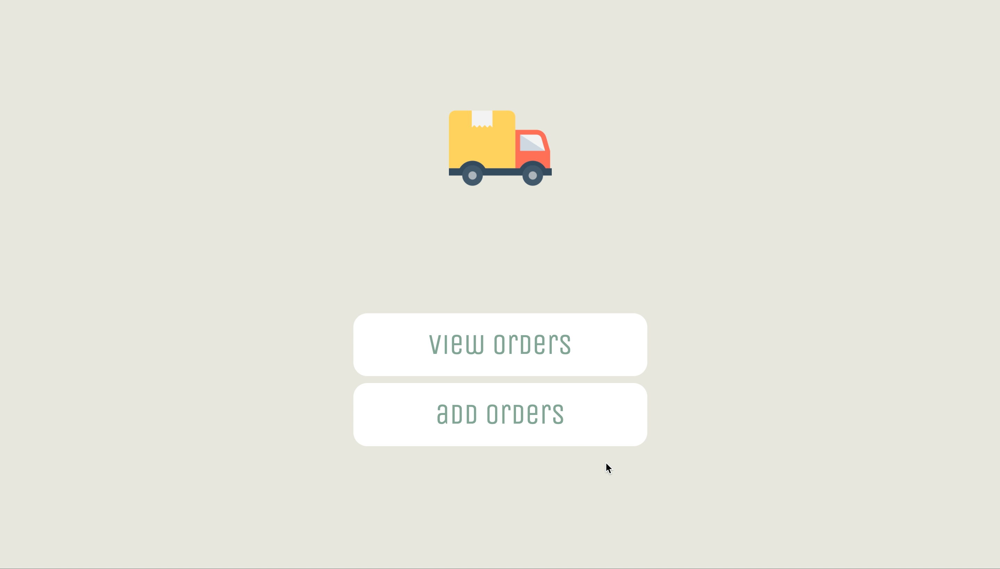

Plivo ETA Notification Example
=======================================

## About

This example shows how [Plivo APIs](http://plivo.com/api) can be used to integrate estimated time arrival notification system into your own web application. This example is built in Python using Flask application framework.

The next section explains how the application works and in-turn how Plivo as a platform works.

## How it works?


## Set up

### Requirements

- Python version >= 3.7.x.
- A Plivo account - [sign up](https://console.plivo.com/accounts/register/)

### Local Development

This application verifies your phone number using the two factor authentication system.

1. Clone this repo.
    ```shell
    git clone https://github.com/plivo/ETA-notifications-flask.git
    ```
2. Change your working directory to 2FA_FlaskApp
    ```shell
    cd ETA-notification-flask
    ```
3. Install the dependencies using the requirements.txt file. You can use the below command.
    ```shell
    pip install -r requirements.txt
    ```
4. Change the placeholders in the `.env` file. You should replace the PLIVO_AUTH_ID, PLIVO_AUTH_TOKEN, PLIVO_NUMBER & PHLO_ID placeholders.

5. You can get your auth_id & auth_token from your [Plivo Console](http://console.plivo.com/). Please [sign up](https://console.plivo.com/accounts/register/) for a Plivo account if you do not have one already. 
    
    **Note:** Enter your phone number in [E.164](http://en.wikipedia.org/wiki/E.164) format. 

6. Use the below command to initiate & setup your db locally. 
    ```shell
    flask db init
    flask db migrate
    flask db upgrade
    ```
7. Use the below command to start the redis. 
    ```shell
    flask run
    ```

### How it works
1. To add it to your order list, enter your name and phone number and click `submit`.
2. Choose View Orders to see your recently added order and change the status to `pickup` or `deliver`.
3. Your order status will be sent to you via SMS.

Helper libraries for various languages are available on the [Plivo github page](http://github.com/plivo).
